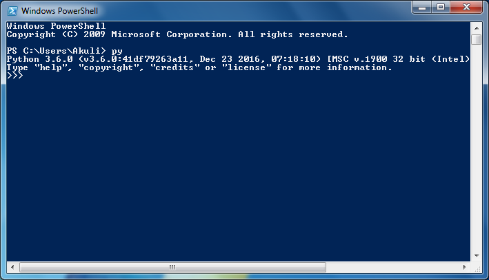
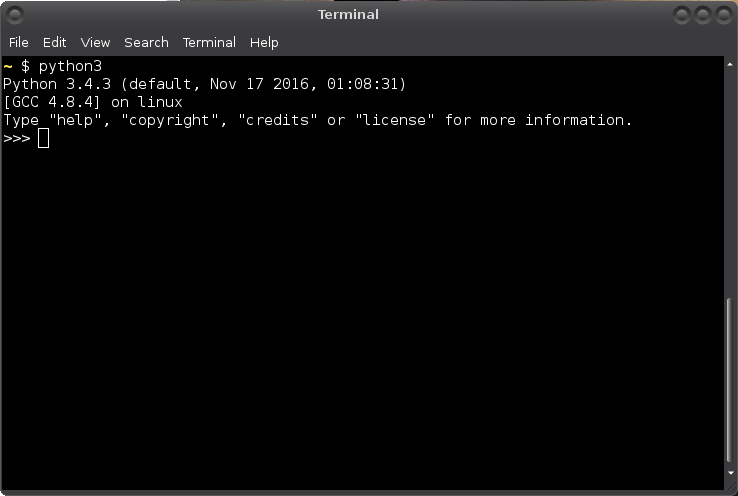

# Installing Python

If you want to learn to program with Python using this tutorial, you
need to try out the code examples. You can use a website like
[repl.it](https://repl.it/languages/python3), but I highly recommend
installing Python. That way you don't need to open a web browser just
to write code, and you can work without an Internet connection.

It doesn't matter which operating system you use because Python runs
great on Windows, Mac OSX, Linux and many other operating systems.
However, installing and launching Python are done differently on
different operating systems, so just follow your operating system's
instructions.

Let's get started!

## Downloading and installing Python

### Windows

Installing Python on Windows is a lot like installing any other program.

1. Go to [the official Python website](https://www.python.org/).
2. Move your mouse over the blue Downloads button, but don't click it.
   Then click the button that downloads the latest version of Python.
3. Run the installer.
4. Make sure that the launcher gets installed and click Install Now.

   

### Mac OSX

At the time of writing this, Macs don't come with a Python 3 and you
need to install it yourself. It should be like installing any other
program, but unfortunately I don't have better instructions because I
don't have an up-to-date Mac and I have never installed Python on a Mac.
If you would like to write better instructions,

### Linux

You already have Python 3, **there's no need to install anything**. You
may also have Python 2, but don't try to remove it. Some of your
programs are probably written in Python 2, so removing Python 2 would
break them.

## Running Python

Next we'll learn to run Python on a PowerShell or terminal. There are
several other ways to run Python, but if you learn this way now it's
going to make things easier later.

### Windows

1. Open a PowerShell from your start menu or start screen.
2. Type `py` and press Enter. You should see something like this:

   

### Other operating systems

1. Open a terminal. How exactly this is done depends on your operating
   system, but most operating systems have some way to search for
   programs. Search for a program called terminal and launch it.
2. Type `python3` and press Enter. You should see something like this:

   

   Your terminal probably looks different than mine, it's OK.

Now you can type `exit()` and press Enter to get out of Python. Or you
can just close the PowerShell or Terminal window.

## Summary

Now you should have Python installed, and you should be able run it.

---
