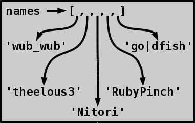

# Lists and tuples

## Why should we use lists?

Sometimes we may end up doing something like this.

```python
name1 = 'wub_wub'
name2 = 'theelous3'
name3 = 'RubyPinch'
name4 = 'go|dfish'
name5 = 'Nitori'

name = input("Enter your name: ")
if name == name1 or name == name2 or name == name3 or name == name4 or name == name5:
    print("I know you!")
else:
    print("Sorry, I don't know who you are :(")
```

This code works just fine, but there's a problem. The name check
is repetitive, and adding a new name requires adding even more
repetitive, boring checks.

## Our first list

Instead of adding a new variable for each name it might be
better to store all names in one variable. This means that our
one variable needs to point to multiple values. An easy way to
do this is using a list:

```python
names = ['wub_wub', 'theelous3', 'Nitori', 'RubyPinch', 'go|dfish']
```

Here the `names` variable points to a list, which then points to
strings, like this:



---
